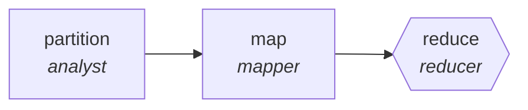

<!-- generated by scripts/gen_cards.py — edit graph.yaml / usecases/catalog.yaml, then `uv run python scripts/gen_cards.py` -->
# 🪪 AGR-028 · `competitive-intelligence`

> Scan competitor releases and filings, reduce to a delta brief.

| Card ID | Domain | Pattern | Nodes | Edges | Verifiers | Routers | Max steps | Risk surface |
|---|---|---|---|---|---|---|---|---|
| `AGR-028` | research-knowledge | **map-reduce** | 3 | 2 | 1 | 0 | 20 | write |

> 🎯 **Requires a goal** — the competitors to profile and the decision the brief informs. Without one the graph refuses and runs no node.

## The graph



Legend: `[/…/]` router · `{{…}}` verifier · `[…]` worker/agent node.

## What it does

Scan competitor releases and filings, reduce to a delta brief.

## Why it should deliver results

Work fans out over shards and the reduce step merges with explicit dedupe and conflict rules, so throughput scales with shard count while the output stays a single consistent artifact.

- **Exit contract** — every finding links a dated public source
- **Machine-checked** — `all(f.source_url and f.source_date for f in output.findings)`
- **Bounded** — hard stop after 20 steps; the topology is acyclic
- **Golden cases** — `uv run agr eval competitive-intelligence` replays recorded cases through the real edge/assert logic (mock runner proves mechanics; `--live` measures your model)
- **Trace gallery** — [every case's route, node outputs, and checked asserts](../../../docs/traces/competitive-intelligence.md)

## How to work with it

```bash
uv run agr show competitive-intelligence       # full definition
uv run agr profile competitive-intelligence    # deterministic structural facts
uv run agr mermaid competitive-intelligence    # regenerate the diagram below
uv run agr eval competitive-intelligence       # run golden cases (add --live for your endpoint)
uv run agr adapt competitive-intelligence --target langgraph > app.py   # compile to runnable LangGraph
uv run agr optimize competitive-intelligence   # propose bounded structural improvements (dry-run)
```

Over MCP: `uv run agr mcp` exposes the registry (search / show / profile) to any MCP client.
To evolve it: `uv run agr infuse competitive-intelligence <node> <ability>` — every mutation is gate-checked and appended to the graph's lineage log.

## Node roster

| Node | Speciality | Kind | Abilities |
|---|---|---|---|
| `partition` | analyst | agent | analyze |
| `map` | mapper | agent | map_shard |
| `reduce` | reducer | verifier | reduce_merge, web_search |

## Edge logic

| From | To | Condition |
|---|---|---|
| `partition` | `map` | always |
| `map` | `reduce` | always |

## Optional use-cases

Adjacent entries from the use-case catalog this card adapts to with small edits:

- **systematic-meta-analysis** (research-knowledge, pipeline) — PRISMA-style screen, extract, pool effect sizes. *Verify:* inclusion log complete; effect sizes recomputable.
- **patent-landscape** (research-knowledge, map-reduce) — Cluster patents by claim family, summarize white space. *Verify:* cluster assignments reproducible; ids valid.
- **survey-design-critic** (research-knowledge, generator-critic) — Draft survey, critic hunts leading and double-barreled items. *Verify:* zero flagged items remain; branching logic validated.
- **grant-proposal-pipeline** (research-knowledge, pipeline) — Aims, methods, budget drafted then compliance-checked. *Verify:* funder checklist items all satisfied.
- **data-catalog-enrichment** (data-analytics, map-reduce) — Describe every table and column, reduce into a searchable catalog. *Verify:* descriptions exist for all tables; lineage links resolve.

---
*Regenerate: `uv run python scripts/gen_cards.py` · Index: [CARDS.md](../../../CARDS.md)*
