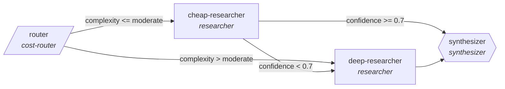

<!-- generated by scripts/gen_cards.py — edit graph.yaml / usecases/catalog.yaml, then `uv run python scripts/gen_cards.py` -->
# 🪪 AGR-113 · `cost-routed-research`

> Routes research subtasks to the cheapest capable model, escalates low-confidence answers, synthesizes with citations.

| Card ID | Domain | Pattern | Nodes | Edges | Verifiers | Routers | Max steps | Risk surface |
|---|---|---|---|---|---|---|---|---|
| `AGR-113` | research-knowledge | **router** | 4 | 5 | 1 | 1 | 20 | read |

## The graph



Legend: `[/…/]` router · `{{…}}` verifier · `[…]` worker/agent node.

## What it does

Routes research subtasks to the cheapest capable model, escalates low-confidence answers, synthesizes with citations.

## Why it should deliver results

A cheap classifier sends every item down the narrowest branch that can handle it, so cost and latency scale with the difficulty of each item rather than the worst case. Escalation edges guarantee hard items still reach the strong path.

- **Exit contract** — synthesizer output cites >=1 source per claim; unverifiable claims are labeled
- **Machine-checked** — `all(c.sources for c in output.claims)`
- **Bounded** — hard stop after 20 steps; the topology is acyclic
- **Golden cases** — `uv run agr eval cost-routed-research` replays recorded cases through the real edge/assert logic (mock runner proves mechanics; `--live` measures your model)
- **Trace gallery** — [every case's route, node outputs, and checked asserts](../../../docs/traces/cost-routed-research.md)

## How to work with it

```bash
uv run agr show cost-routed-research       # full definition
uv run agr profile cost-routed-research    # deterministic structural facts
uv run agr mermaid cost-routed-research    # regenerate the diagram below
uv run agr eval cost-routed-research       # run golden cases (add --live for your endpoint)
uv run agr adapt cost-routed-research --target langgraph > app.py   # compile to runnable LangGraph
uv run agr optimize cost-routed-research   # propose bounded structural improvements (dry-run)
```

Over MCP: `uv run agr mcp` exposes the registry (search / show / profile) to any MCP client.
To evolve it: `uv run agr infuse cost-routed-research <node> <ability>` — every mutation is gate-checked and appended to the graph's lineage log.

## Node roster

| Node | Speciality | Kind | Abilities |
|---|---|---|---|
| `router` | cost-router | router | classify_complexity |
| `cheap-researcher` | researcher | agent | web_search |
| `deep-researcher` | researcher | agent | web_search, read_papers |
| `synthesizer` | synthesizer | verifier | cite_sources |

## Edge logic

| From | To | Condition |
|---|---|---|
| `router` | `cheap-researcher` | complexity <= moderate |
| `router` | `deep-researcher` | complexity > moderate |
| `cheap-researcher` | `deep-researcher` | confidence < 0.7 |
| `cheap-researcher` | `synthesizer` | confidence >= 0.7 |
| `deep-researcher` | `synthesizer` | always |

## Optional use-cases

Adjacent entries from the use-case catalog this card adapts to with small edits:

- **systematic-meta-analysis** (research-knowledge, pipeline) — PRISMA-style screen, extract, pool effect sizes. *Verify:* inclusion log complete; effect sizes recomputable.
- **patent-landscape** (research-knowledge, map-reduce) — Cluster patents by claim family, summarize white space. *Verify:* cluster assignments reproducible; ids valid.
- **survey-design-critic** (research-knowledge, generator-critic) — Draft survey, critic hunts leading and double-barreled items. *Verify:* zero flagged items remain; branching logic validated.
- **grant-proposal-pipeline** (research-knowledge, pipeline) — Aims, methods, budget drafted then compliance-checked. *Verify:* funder checklist items all satisfied.
- **fraud-pattern-triage** (finance, router) — Route flagged transactions to rule, anomaly, or manual review. *Verify:* routing precision measured against labeled history.

---
*Regenerate: `uv run python scripts/gen_cards.py` · Index: [CARDS.md](../../../CARDS.md)*
