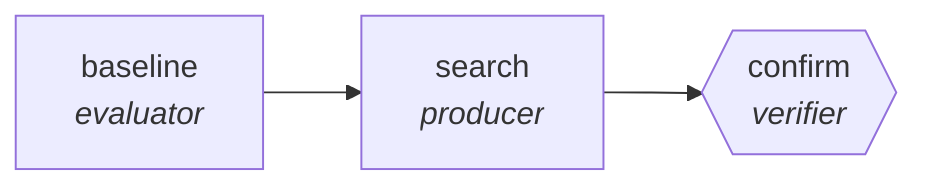

<!-- generated by scripts/gen_cards.py — edit graph.yaml / usecases/catalog.yaml, then `uv run python scripts/gen_cards.py` -->
# 🪪 AGR-125 · `prompt-graph-optimization`

> Search prompt-and-topology variants against a held-out eval set, keeping only measured winners.

| Card ID | Domain | Pattern | Nodes | Edges | Verifiers | Routers | Max steps | Risk surface |
|---|---|---|---|---|---|---|---|---|
| `AGR-125` | research-knowledge | **tree-search** | 3 | 2 | 1 | 0 | 40 | execute |

> 🎯 **Requires a goal** — the graph to optimize and the metric that decides a winner. Without one the graph refuses and runs no node.

## The graph



Legend: `[/…/]` router · `{{…}}` verifier · `[…]` worker/agent node.

## What it does

Search prompt and topology variants against a held-out eval set.

## Why it should deliver results

Candidates are branched, scored against a real measurement, and pruned to a beam — so the graph explores a space rather than committing to its first idea. This is beam search, not MCTS: no rollout policy and no learned value function, both of which need a real environment. What ships is whatever measurably won.

- **Exit contract** — a variant ships only if it beats baseline on a held-out set it was not searched against
- **Machine-checked** — `output.holdout_score > output.baseline_score`
- **Bounded** — hard stop after 40 steps; the topology is acyclic
- **Golden cases** — `uv run agr eval prompt-graph-optimization` replays recorded cases through the real edge/assert logic (mock runner proves mechanics; `--live` measures your model)
- **Trace gallery** — [every case's route, node outputs, and checked asserts](../../../docs/traces/prompt-graph-optimization.md)

## How to work with it

```bash
uv run agr show prompt-graph-optimization       # full definition
uv run agr profile prompt-graph-optimization    # deterministic structural facts
uv run agr mermaid prompt-graph-optimization    # regenerate the diagram below
uv run agr eval prompt-graph-optimization       # run golden cases (add --live for your endpoint)
uv run agr adapt prompt-graph-optimization --target langgraph > app.py   # compile to runnable LangGraph
uv run agr optimize prompt-graph-optimization   # propose bounded structural improvements (dry-run)
```

Over MCP: `uv run agr mcp` exposes the registry (search / show / profile) to any MCP client.
To evolve it: `uv run agr infuse prompt-graph-optimization <node> <ability>` — every mutation is gate-checked and appended to the graph's lineage log.

## Node roster

| Node | Speciality | Kind | Abilities |
|---|---|---|---|
| `baseline` | evaluator | agent | evaluate |
| `search` | producer | search | generate |
| `confirm` | verifier | verifier | run_command |

## Edge logic

| From | To | Condition |
|---|---|---|
| `baseline` | `search` | always |
| `search` | `confirm` | always |

## Optional use-cases

Adjacent entries from the use-case catalog this card adapts to with small edits:

- **systematic-meta-analysis** (research-knowledge, pipeline) — PRISMA-style screen, extract, pool effect sizes. *Verify:* inclusion log complete; effect sizes recomputable.
- **patent-landscape** (research-knowledge, map-reduce) — Cluster patents by claim family, summarize white space. *Verify:* cluster assignments reproducible; ids valid.
- **survey-design-critic** (research-knowledge, generator-critic) — Draft survey, critic hunts leading and double-barreled items. *Verify:* zero flagged items remain; branching logic validated.
- **grant-proposal-pipeline** (research-knowledge, pipeline) — Aims, methods, budget drafted then compliance-checked. *Verify:* funder checklist items all satisfied.

---
*Regenerate: `uv run python scripts/gen_cards.py` · Index: [CARDS.md](../../../CARDS.md)*
