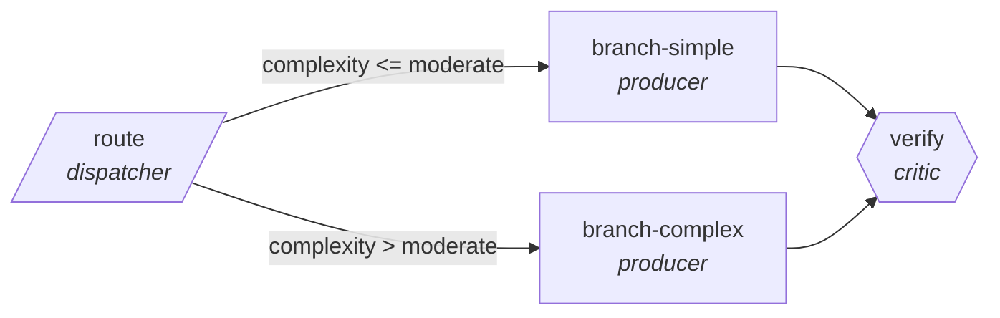

<!-- generated by scripts/gen_cards.py — edit graph.yaml / usecases/catalog.yaml, then `uv run python scripts/gen_cards.py` -->
# 🪪 AGR-085 · `phishing-triage`

> Classify reported emails, route confirmed phish to response.

| Card ID | Domain | Pattern | Nodes | Edges | Verifiers | Routers | Max steps | Risk surface |
|---|---|---|---|---|---|---|---|---|
| `AGR-085` | security | **router** | 4 | 4 | 1 | 1 | 12 | write |

## The graph



Legend: `[/…/]` router · `{{…}}` verifier · `[…]` worker/agent node.

## What it does

Classify reported emails, route confirmed phish to response.

## Why it should deliver results

A cheap classifier sends every item down the narrowest branch that can handle it, so cost and latency scale with the difficulty of each item rather than the worst case. Escalation edges guarantee hard items still reach the strong path.

- **Exit contract** — verdicts benchmarked against labeled corpus
- **Machine-checked** — `output.matches_labeled_corpus`
- **Bounded** — hard stop after 12 steps; the topology is acyclic
- **Golden cases** — `uv run agr eval phishing-triage` replays recorded cases through the real edge/assert logic (mock runner proves mechanics; `--live` measures your model)
- **Trace gallery** — [every case's route, node outputs, and checked asserts](../../../docs/traces/phishing-triage.md)

## How to work with it

```bash
uv run agr show phishing-triage       # full definition
uv run agr profile phishing-triage    # deterministic structural facts
uv run agr mermaid phishing-triage    # regenerate the diagram below
uv run agr eval phishing-triage       # run golden cases (add --live for your endpoint)
uv run agr adapt phishing-triage --target langgraph > app.py   # compile to runnable LangGraph
uv run agr optimize phishing-triage   # propose bounded structural improvements (dry-run)
```

Over MCP: `uv run agr mcp` exposes the registry (search / show / profile) to any MCP client.
To evolve it: `uv run agr infuse phishing-triage <node> <ability>` — every mutation is gate-checked and appended to the graph's lineage log.

## Node roster

| Node | Speciality | Kind | Abilities |
|---|---|---|---|
| `route` | dispatcher | router | dispatch |
| `branch-simple` | producer | agent | generate |
| `branch-complex` | producer | agent | generate |
| `verify` | critic | verifier | critique |

## Edge logic

| From | To | Condition |
|---|---|---|
| `route` | `branch-simple` | complexity <= moderate |
| `route` | `branch-complex` | complexity > moderate |
| `branch-simple` | `verify` | always |
| `branch-complex` | `verify` | always |

## Optional use-cases

Adjacent entries from the use-case catalog this card adapts to with small edits:

- **pentest-report-synthesis** (security, pipeline) — Merge tester notes into a findings report with severities. *Verify:* every finding has repro steps and evidence.
- **supply-chain-audit** (security, parallel-swarm) — Workers audit dependencies for provenance and tampering. *Verify:* attestations verified; unsigned artifacts listed.
- **compliance-evidence-collector** (security, map-reduce) — Gather control evidence per framework requirement. *Verify:* every control maps to dated evidence artifacts.
- **invoice-reconciliation** (business-ops, router) — Match invoices to POs, route exceptions by mismatch type. *Verify:* matched set balances; exceptions carry mismatch reason.
- **fraud-pattern-triage** (finance, router) — Route flagged transactions to rule, anomaly, or manual review. *Verify:* routing precision measured against labeled history.

---
*Regenerate: `uv run python scripts/gen_cards.py` · Index: [CARDS.md](../../../CARDS.md)*
