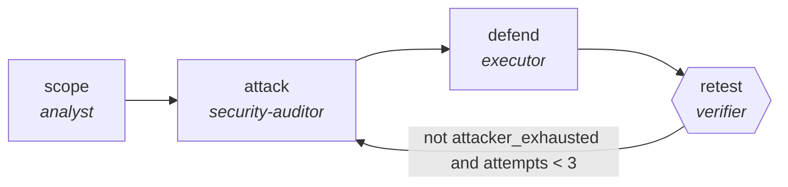

<!-- generated by scripts/gen_cards.py — edit graph.yaml / usecases/catalog.yaml, then `uv run python scripts/gen_cards.py` -->
# 🪪 AGR-127 · `red-team-blue-team-hardening`

> An attacker searches for a working bypass while a defender patches, until the attacker is exhausted.

| Card ID | Domain | Pattern | Nodes | Edges | Verifiers | Routers | Max steps | Risk surface |
|---|---|---|---|---|---|---|---|---|
| `AGR-127` | security | **red-team-blue-team** | 4 | 4 | 1 | 0 | 45 | execute |

> 🎯 **Requires a goal** — the system to harden and the threat model to harden it against. Without one the graph refuses and runs no node.

## The graph



Legend: `[/…/]` router · `{{…}}` verifier · `[…]` worker/agent node.

## What it does

Attacker searches for a bypass while a defender patches, until exhaustion.

## Why it should deliver results

An attacker searches for a working bypass while a defender patches, alternating until the attacker is exhausted. It is the only motif here that produces evidence of *absence*: the run ends because nothing more could be found, not because nobody looked.

- **Exit contract** — terminates on attacker exhaustion, producing evidence of absence rather than absence of evidence
- **Machine-checked** — `all(b.mitigation_ref for b in output.bypasses)`
- **Machine-checked** — `output.unmitigated == 0`
- **Command-checked** — `pytest -q {exploit_suite}`
- **Bounded** — hard stop after 45 steps; every loop edge is condition-guarded
- **Golden cases** — `uv run agr eval red-team-blue-team-hardening` replays recorded cases through the real edge/assert logic (mock runner proves mechanics; `--live` measures your model)
- **Trace gallery** — [every case's route, node outputs, and checked asserts](../../../docs/traces/red-team-blue-team-hardening.md)

## How to work with it

```bash
uv run agr show red-team-blue-team-hardening       # full definition
uv run agr profile red-team-blue-team-hardening    # deterministic structural facts
uv run agr mermaid red-team-blue-team-hardening    # regenerate the diagram below
uv run agr eval red-team-blue-team-hardening       # run golden cases (add --live for your endpoint)
uv run agr adapt red-team-blue-team-hardening --target langgraph > app.py   # compile to runnable LangGraph
uv run agr optimize red-team-blue-team-hardening   # propose bounded structural improvements (dry-run)
```

Over MCP: `uv run agr mcp` exposes the registry (search / show / profile) to any MCP client.
To evolve it: `uv run agr infuse red-team-blue-team-hardening <node> <ability>` — every mutation is gate-checked and appended to the graph's lineage log.

## Node roster

| Node | Speciality | Kind | Abilities |
|---|---|---|---|
| `scope` | analyst | agent | analyze |
| `attack` | security-auditor | search | sast_scan, read_diff |
| `defend` | executor | agent | execute_step, edit_files |
| `retest` | verifier | verifier | run_command |

## Edge logic

| From | To | Condition |
|---|---|---|
| `scope` | `attack` | always |
| `attack` | `defend` | always |
| `defend` | `retest` | always |
| `retest` | `attack` | not attacker_exhausted and attempts < 3 |

## Optional use-cases

Adjacent entries from the use-case catalog this card adapts to with small edits:

- **pentest-report-synthesis** (security, pipeline) — Merge tester notes into a findings report with severities. *Verify:* every finding has repro steps and evidence.
- **supply-chain-audit** (security, parallel-swarm) — Workers audit dependencies for provenance and tampering. *Verify:* attestations verified; unsigned artifacts listed.

---
*Regenerate: `uv run python scripts/gen_cards.py` · Index: [CARDS.md](../../../CARDS.md)*
