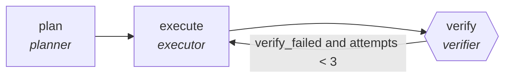

<!-- generated by scripts/gen_cards.py — edit graph.yaml / usecases/catalog.yaml, then `uv run python scripts/gen_cards.py` -->
# 🪪 AGR-087 · `soc-alert-investigation`

> Investigate an alert with hypothesis-driven queries.

| Card ID | Domain | Pattern | Nodes | Edges | Verifiers | Routers | Max steps | Risk surface |
|---|---|---|---|---|---|---|---|---|
| `AGR-087` | security | **planner-executor-verifier** | 3 | 3 | 1 | 0 | 25 | execute |

## The graph



Legend: `[/…/]` router · `{{…}}` verifier · `[…]` worker/agent node.

## What it does

Investigate an alert with hypothesis-driven queries.

## Why it should deliver results

The plan makes intent inspectable before anything touches the world, the executor works inside that plan, and the verifier proves the postcondition actually holds — success is demonstrated, not asserted.

- **Exit contract** — conclusion supported by query results attached
- **Machine-checked** — `conclusion supported by query results attached`
- **Bounded** — hard stop after 25 steps; every loop edge is condition-guarded
- **Gate-checked** — schema + lint + structural gate run in CI; golden eval cases are the next step for this card (see `evals/` for the format)

## How to work with it

```bash
uv run agr show soc-alert-investigation       # full definition
uv run agr profile soc-alert-investigation    # deterministic structural facts
uv run agr mermaid soc-alert-investigation    # regenerate the diagram below
uv run agr adapt soc-alert-investigation --target langgraph > app.py   # compile to runnable LangGraph
uv run agr optimize soc-alert-investigation   # propose bounded structural improvements (dry-run)
```

Over MCP: `uv run agr mcp` exposes the registry (search / show / profile) to any MCP client.
To evolve it: `uv run agr infuse soc-alert-investigation <node> <ability>` — every mutation is gate-checked and appended to the graph's lineage log.

## Node roster

| Node | Speciality | Kind | Abilities |
|---|---|---|---|
| `plan` | planner | agent | decompose_goal |
| `execute` | executor | agent | execute_step |
| `verify` | verifier | verifier | run_command |

## Edge logic

| From | To | Condition |
|---|---|---|
| `plan` | `execute` | always |
| `execute` | `verify` | always |
| `verify` | `execute` | verify_failed and attempts < 3 |

## Optional use-cases

Adjacent entries from the use-case catalog this card adapts to with small edits:

- **pentest-report-synthesis** (security, pipeline) — Merge tester notes into a findings report with severities. *Verify:* every finding has repro steps and evidence.
- **supply-chain-audit** (security, parallel-swarm) — Workers audit dependencies for provenance and tampering. *Verify:* attestations verified; unsigned artifacts listed.
- **compliance-evidence-collector** (security, map-reduce) — Gather control evidence per framework requirement. *Verify:* every control maps to dated evidence artifacts.
- **framework-migration** (software-engineering, planner-executor-verifier) — Port a codebase between frameworks in verifiable slices. *Verify:* build and full test suite green on target stack.
- **schema-migration-planner** (data-analytics, planner-executor-verifier) — Plan backward-compatible schema changes with shadow reads. *Verify:* shadow-read diff empty before cutover.

---
*Regenerate: `uv run python scripts/gen_cards.py` · Index: [CARDS.md](../../../CARDS.md)*
