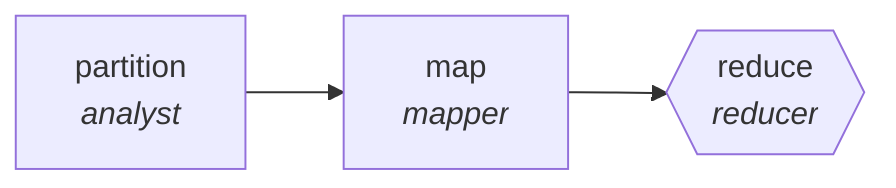

<!-- generated by scripts/gen_cards.py — edit graph.yaml / usecases/catalog.yaml, then `uv run python scripts/gen_cards.py` -->
# 🪪 AGR-084 · `threat-intel-digest`

> Summarize feeds into an actionable daily brief.

| Card ID | Domain | Pattern | Nodes | Edges | Verifiers | Routers | Max steps | Risk surface |
|---|---|---|---|---|---|---|---|---|
| `AGR-084` | security | **map-reduce** | 3 | 2 | 1 | 0 | 20 | write |

## The graph



Legend: `[/…/]` router · `{{…}}` verifier · `[…]` worker/agent node.

## What it does

Summarize feeds into an actionable daily brief.

## Why it should deliver results

Work fans out over shards and the reduce step merges with explicit dedupe and conflict rules, so throughput scales with shard count while the output stays a single consistent artifact.

- **Exit contract** — every item links source advisory with CVE ids
- **Machine-checked** — `all(i.advisory_url and i.cve_ids for i in output.entries)`
- **Bounded** — hard stop after 20 steps; the topology is acyclic
- **Golden cases** — `uv run agr eval threat-intel-digest` replays recorded cases through the real edge/assert logic (mock runner proves mechanics; `--live` measures your model)
- **Trace gallery** — [every case's route, node outputs, and checked asserts](../../../docs/traces/threat-intel-digest.md)

## How to work with it

```bash
uv run agr show threat-intel-digest       # full definition
uv run agr profile threat-intel-digest    # deterministic structural facts
uv run agr mermaid threat-intel-digest    # regenerate the diagram below
uv run agr eval threat-intel-digest       # run golden cases (add --live for your endpoint)
uv run agr adapt threat-intel-digest --target langgraph > app.py   # compile to runnable LangGraph
uv run agr optimize threat-intel-digest   # propose bounded structural improvements (dry-run)
```

Over MCP: `uv run agr mcp` exposes the registry (search / show / profile) to any MCP client.
To evolve it: `uv run agr infuse threat-intel-digest <node> <ability>` — every mutation is gate-checked and appended to the graph's lineage log.

## Node roster

| Node | Speciality | Kind | Abilities |
|---|---|---|---|
| `partition` | analyst | agent | analyze |
| `map` | mapper | agent | map_shard |
| `reduce` | reducer | verifier | reduce_merge |

## Edge logic

| From | To | Condition |
|---|---|---|
| `partition` | `map` | always |
| `map` | `reduce` | always |

## Optional use-cases

Adjacent entries from the use-case catalog this card adapts to with small edits:

- **pentest-report-synthesis** (security, pipeline) — Merge tester notes into a findings report with severities. *Verify:* every finding has repro steps and evidence.
- **supply-chain-audit** (security, parallel-swarm) — Workers audit dependencies for provenance and tampering. *Verify:* attestations verified; unsigned artifacts listed.
- **data-catalog-enrichment** (data-analytics, map-reduce) — Describe every table and column, reduce into a searchable catalog. *Verify:* descriptions exist for all tables; lineage links resolve.
- **patent-landscape** (research-knowledge, map-reduce) — Cluster patents by claim family, summarize white space. *Verify:* cluster assignments reproducible; ids valid.
- **newsletter-assembler** (content-marketing, map-reduce) — Summarize the period's items, reduce into sections. *Verify:* every item links its source; dead links zero.

---
*Regenerate: `uv run python scripts/gen_cards.py` · Index: [CARDS.md](../../../CARDS.md)*
