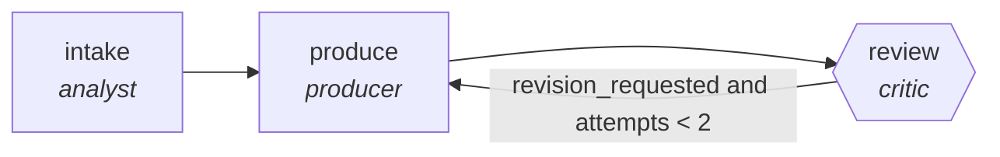

<!-- generated by scripts/gen_cards.py — edit graph.yaml / usecases/catalog.yaml, then `uv run python scripts/gen_cards.py` -->
# 🪪 AGR-086 · `vuln-prioritization`

> Rank findings by exploitability and blast radius.

| Card ID | Domain | Pattern | Nodes | Edges | Verifiers | Routers | Max steps | Risk surface |
|---|---|---|---|---|---|---|---|---|
| `AGR-086` | security | **pipeline** | 3 | 3 | 1 | 0 | 12 | write |

## The graph



Legend: `[/…/]` router · `{{…}}` verifier · `[…]` worker/agent node.

## What it does

Rank findings by exploitability and blast radius.

## Why it should deliver results

Staged specialists each own one narrow concern, so quality problems are localized to the stage that produced them instead of being smeared across a single mega-prompt. Output only leaves the graph through the exit contract.

- **Exit contract** — ranking inputs cite scanner evidence and asset map
- **Machine-checked** — `all(r.scanner_evidence and r.asset_map_ref for r in output.ranking)`
- **Bounded** — hard stop after 12 steps; every loop edge is condition-guarded
- **Golden cases** — `uv run agr eval vuln-prioritization` replays recorded cases through the real edge/assert logic (mock runner proves mechanics; `--live` measures your model)
- **Trace gallery** — [every case's route, node outputs, and checked asserts](../../../docs/traces/vuln-prioritization.md)

## How to work with it

```bash
uv run agr show vuln-prioritization       # full definition
uv run agr profile vuln-prioritization    # deterministic structural facts
uv run agr mermaid vuln-prioritization    # regenerate the diagram below
uv run agr eval vuln-prioritization       # run golden cases (add --live for your endpoint)
uv run agr adapt vuln-prioritization --target langgraph > app.py   # compile to runnable LangGraph
uv run agr optimize vuln-prioritization   # propose bounded structural improvements (dry-run)
```

Over MCP: `uv run agr mcp` exposes the registry (search / show / profile) to any MCP client.
To evolve it: `uv run agr infuse vuln-prioritization <node> <ability>` — every mutation is gate-checked and appended to the graph's lineage log.

## Node roster

| Node | Speciality | Kind | Abilities |
|---|---|---|---|
| `intake` | analyst | agent | analyze |
| `produce` | producer | agent | generate |
| `review` | critic | verifier | critique |

## Edge logic

| From | To | Condition |
|---|---|---|
| `intake` | `produce` | always |
| `produce` | `review` | always |
| `review` | `produce` | revision_requested and attempts < 2 |

## Optional use-cases

Adjacent entries from the use-case catalog this card adapts to with small edits:

- **pentest-report-synthesis** (security, pipeline) — Merge tester notes into a findings report with severities. *Verify:* every finding has repro steps and evidence.
- **supply-chain-audit** (security, parallel-swarm) — Workers audit dependencies for provenance and tampering. *Verify:* attestations verified; unsigned artifacts listed.
- **compliance-evidence-collector** (security, map-reduce) — Gather control evidence per framework requirement. *Verify:* every control maps to dated evidence artifacts.
- **cloud-cost-optimizer** (devops-sre, pipeline) — Scan usage, propose rightsizing, verify against SLO headroom. *Verify:* projected savings computed from real billing export.
- **dashboard-builder** (data-analytics, pipeline) — From metric spec to working dashboard with tested queries. *Verify:* every panel query executes under latency budget.

---
*Regenerate: `uv run python scripts/gen_cards.py` · Index: [CARDS.md](../../../CARDS.md)*
