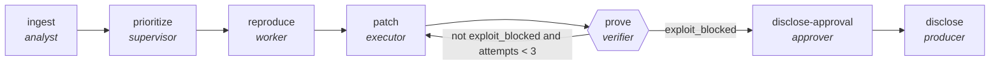

<!-- generated by scripts/gen_cards.py — edit graph.yaml / usecases/catalog.yaml, then `uv run python scripts/gen_cards.py` -->
# 🪪 AGR-117 · `vuln-remediation-lifecycle`

> Ingest a vulnerability, prioritize it, reproduce it, patch it, prove the patch, and disclose behind a human gate.

| Card ID | Domain | Pattern | Nodes | Edges | Verifiers | Routers | Max steps | Risk surface |
|---|---|---|---|---|---|---|---|---|
| `AGR-117` | security | **lifecycle** | 7 | 7 | 1 | 0 | 45 | execute |

> 🎯 **Requires a goal** — the vulnerability to remediate and the affected estate. Without one the graph refuses and runs no node.

## The graph



Legend: `[/…/]` router · `{{…}}` verifier · `[…]` worker/agent node.

## What it does

Ingest, prioritize, reproduce, patch, prove and disclose a vulnerability behind a human gate.

## Why it should deliver results

A multi-phase workflow where each phase is itself a motif and hand-offs are explicit. Phases that duplicate an existing single-purpose graph reference it with `kind: subgraph` instead of restating it, so the flat library becomes the component library and a fix to a child propagates to every composite using it.

- **Exit contract** — nothing is disclosed until the exploit is proven blocked and a human has signed off
- **Machine-checked** — `output.exploit_blocked == true`
- **Machine-checked** — `output.signed_off == true`
- **Machine-checked** — `output.advisory_published == true`
- **Bounded** — hard stop after 45 steps; every loop edge is condition-guarded
- **Golden cases** — `uv run agr eval vuln-remediation-lifecycle` replays recorded cases through the real edge/assert logic (mock runner proves mechanics; `--live` measures your model)
- **Trace gallery** — [every case's route, node outputs, and checked asserts](../../../docs/traces/vuln-remediation-lifecycle.md)

## How to work with it

```bash
uv run agr show vuln-remediation-lifecycle       # full definition
uv run agr profile vuln-remediation-lifecycle    # deterministic structural facts
uv run agr mermaid vuln-remediation-lifecycle    # regenerate the diagram below
uv run agr eval vuln-remediation-lifecycle       # run golden cases (add --live for your endpoint)
uv run agr adapt vuln-remediation-lifecycle --target langgraph > app.py   # compile to runnable LangGraph
uv run agr optimize vuln-remediation-lifecycle   # propose bounded structural improvements (dry-run)
```

Over MCP: `uv run agr mcp` exposes the registry (search / show / profile) to any MCP client.
To evolve it: `uv run agr infuse vuln-remediation-lifecycle <node> <ability>` — every mutation is gate-checked and appended to the graph's lineage log.

## Node roster

| Node | Speciality | Kind | Abilities |
|---|---|---|---|
| `ingest` | analyst | agent | analyze |
| `prioritize` | supervisor | subgraph | — |
| `reproduce` | worker | agent | run_command, edit_files |
| `patch` | executor | agent | execute_step, edit_files |
| `prove` | verifier | verifier | run_command |
| `disclose-approval` | approver | human | approve |
| `disclose` | producer | agent | generate |

## Edge logic

| From | To | Condition |
|---|---|---|
| `ingest` | `prioritize` | always |
| `prioritize` | `reproduce` | always |
| `reproduce` | `patch` | always |
| `patch` | `prove` | always |
| `prove` | `patch` | not exploit_blocked and attempts < 3 |
| `prove` | `disclose-approval` | exploit_blocked |
| `disclose-approval` | `disclose` | always |

## Optional use-cases

Adjacent entries from the use-case catalog this card adapts to with small edits:

- **pentest-report-synthesis** (security, pipeline) — Merge tester notes into a findings report with severities. *Verify:* every finding has repro steps and evidence.
- **supply-chain-audit** (security, parallel-swarm) — Workers audit dependencies for provenance and tampering. *Verify:* attestations verified; unsigned artifacts listed.

---
*Regenerate: `uv run python scripts/gen_cards.py` · Index: [CARDS.md](../../../CARDS.md)*
