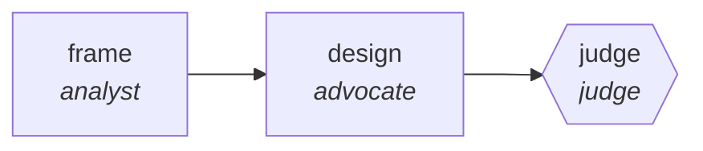

<!-- generated by scripts/gen_cards.py — edit graph.yaml / usecases/catalog.yaml, then `uv run python scripts/gen_cards.py` -->
# 🪪 AGR-131 · `architecture-decision-tournament`

> Independent designs are scored on one rubric, and the winner must beat the runner-up on record.

| Card ID | Domain | Pattern | Nodes | Edges | Verifiers | Routers | Max steps | Risk surface |
|---|---|---|---|---|---|---|---|---|
| `AGR-131` | software-engineering | **tournament** | 3 | 2 | 1 | 0 | 30 | write |

## The graph



Legend: `[/…/]` router · `{{…}}` verifier · `[…]` worker/agent node.

## What it does

Independent designs scored on one rubric; the winner beats the runner-up on record.

## Why it should deliver results

More than two options, judged pairwise on one rubric, with the winner recorded alongside the margin over the runner-up. A single debate collapses to two positions; a tournament keeps the field, and the recorded margin means the decision can be revisited on evidence instead of re-argued from scratch.

- **Exit contract** — a decision names its runner-up and the margin, so it can be revisited on evidence
- **Machine-checked** — `output.designs_scored >= 3`
- **Machine-checked** — `output.margin is not None`
- **Bounded** — hard stop after 30 steps; the topology is acyclic
- **Golden cases** — `uv run agr eval architecture-decision-tournament` replays recorded cases through the real edge/assert logic (mock runner proves mechanics; `--live` measures your model)
- **Trace gallery** — [every case's route, node outputs, and checked asserts](../../../docs/traces/architecture-decision-tournament.md)

## How to work with it

```bash
uv run agr show architecture-decision-tournament       # full definition
uv run agr profile architecture-decision-tournament    # deterministic structural facts
uv run agr mermaid architecture-decision-tournament    # regenerate the diagram below
uv run agr eval architecture-decision-tournament       # run golden cases (add --live for your endpoint)
uv run agr adapt architecture-decision-tournament --target langgraph > app.py   # compile to runnable LangGraph
uv run agr optimize architecture-decision-tournament   # propose bounded structural improvements (dry-run)
```

Over MCP: `uv run agr mcp` exposes the registry (search / show / profile) to any MCP client.
To evolve it: `uv run agr infuse architecture-decision-tournament <node> <ability>` — every mutation is gate-checked and appended to the graph's lineage log.

## Node roster

| Node | Speciality | Kind | Abilities |
|---|---|---|---|
| `frame` | analyst | agent | analyze |
| `design` | advocate | agent | generate |
| `judge` | judge | verifier | adjudicate |

## Edge logic

| From | To | Condition |
|---|---|---|
| `frame` | `design` | always |
| `design` | `judge` | always |

## Optional use-cases

Adjacent entries from the use-case catalog this card adapts to with small edits:

- **api-design-review** (software-engineering, debate) — Two reviewers argue REST versus RPC tradeoffs, judge synthesizes. *Verify:* spec passes lint; breaking changes enumerated.

---
*Regenerate: `uv run python scripts/gen_cards.py` · Index: [CARDS.md](../../../CARDS.md)*
