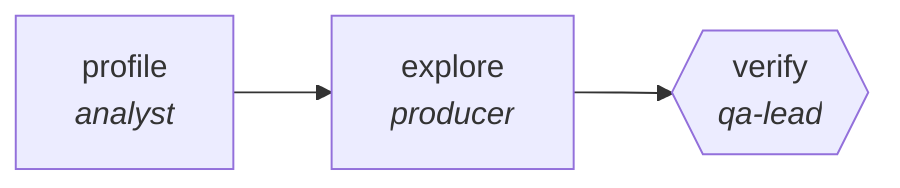

<!-- generated by scripts/gen_cards.py — edit graph.yaml / usecases/catalog.yaml, then `uv run python scripts/gen_cards.py` -->
# 🪪 AGR-124 · `benchmark-driven-optimization-search`

> Branch candidate optimizations, score each on a real benchmark, keep the beam, prune the rest.

| Card ID | Domain | Pattern | Nodes | Edges | Verifiers | Routers | Max steps | Risk surface |
|---|---|---|---|---|---|---|---|---|
| `AGR-124` | software-engineering | **tree-search** | 3 | 2 | 1 | 0 | 40 | execute |

> 🎯 **Requires a goal** — the repository to optimize and the benchmark that scores it. Without one the graph refuses and runs no node.

## The graph



Legend: `[/…/]` router · `{{…}}` verifier · `[…]` worker/agent node.

## What it does

Branch candidate optimizations, score each on a benchmark, keep the beam.

## Why it should deliver results

Candidates are branched, scored against a real measurement, and pruned to a beam — so the graph explores a space rather than committing to its first idea. This is beam search, not MCTS: no rollout policy and no learned value function, both of which need a real environment. What ships is whatever measurably won.

- **Exit contract** — the retained candidate is faster than baseline with a green suite; losers are pruned, not shipped
- **Machine-checked** — `output.bench_ms < output.baseline_ms`
- **Machine-checked** — `output.suite_green == true`
- **Bounded** — hard stop after 40 steps; the topology is acyclic
- **Golden cases** — `uv run agr eval benchmark-driven-optimization-search` replays recorded cases through the real edge/assert logic (mock runner proves mechanics; `--live` measures your model)
- **Trace gallery** — [every case's route, node outputs, and checked asserts](../../../docs/traces/benchmark-driven-optimization-search.md)

## How to work with it

```bash
uv run agr show benchmark-driven-optimization-search       # full definition
uv run agr profile benchmark-driven-optimization-search    # deterministic structural facts
uv run agr mermaid benchmark-driven-optimization-search    # regenerate the diagram below
uv run agr eval benchmark-driven-optimization-search       # run golden cases (add --live for your endpoint)
uv run agr adapt benchmark-driven-optimization-search --target langgraph > app.py   # compile to runnable LangGraph
uv run agr optimize benchmark-driven-optimization-search   # propose bounded structural improvements (dry-run)
```

Over MCP: `uv run agr mcp` exposes the registry (search / show / profile) to any MCP client.
To evolve it: `uv run agr infuse benchmark-driven-optimization-search <node> <ability>` — every mutation is gate-checked and appended to the graph's lineage log.

## Node roster

| Node | Speciality | Kind | Abilities |
|---|---|---|---|
| `profile` | analyst | agent | analyze |
| `explore` | producer | search | generate |
| `verify` | qa-lead | verifier | run_suite |

## Edge logic

| From | To | Condition |
|---|---|---|
| `profile` | `explore` | always |
| `explore` | `verify` | always |

## Optional use-cases

Adjacent entries from the use-case catalog this card adapts to with small edits:

- **api-design-review** (software-engineering, debate) — Two reviewers argue REST versus RPC tradeoffs, judge synthesizes. *Verify:* spec passes lint; breaking changes enumerated.

---
*Regenerate: `uv run python scripts/gen_cards.py` · Index: [CARDS.md](../../../CARDS.md)*
