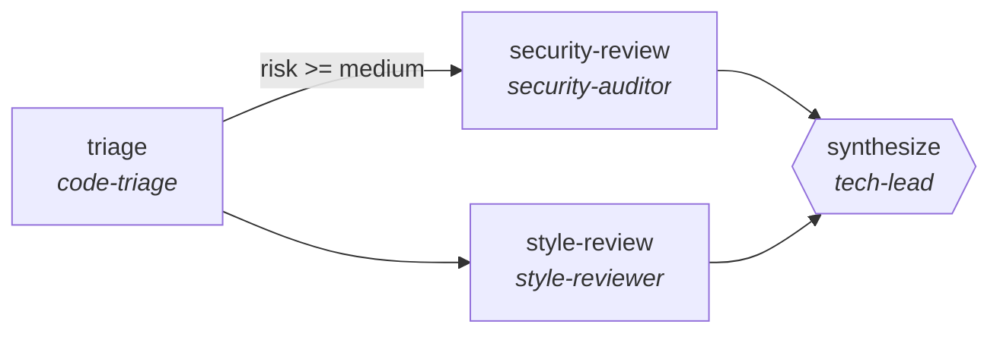

<!-- generated by scripts/gen_cards.py — edit graph.yaml / usecases/catalog.yaml, then `uv run python scripts/gen_cards.py` -->
# 🪪 AGR-001 · `code-review-pipeline`

> Multi-stage PR review that triages risk, splits security and style review, and synthesizes one verdict.

| Card ID | Domain | Pattern | Nodes | Edges | Verifiers | Routers | Max steps | Risk surface |
|---|---|---|---|---|---|---|---|---|
| `AGR-001` | software-engineering | **pipeline** | 4 | 4 | 1 | 0 | 12 | read |

## The graph



Legend: `[/…/]` router · `{{…}}` verifier · `[…]` worker/agent node.

## What it does

Staged PR review with risk triage and parallel security plus style passes.

## Why it should deliver results

Staged specialists each own one narrow concern, so quality problems are localized to the stage that produced them instead of being smeared across a single mega-prompt. Output only leaves the graph through the exit contract.

- **Exit contract** — synthesize emits a verdict in {approve, request_changes} with every finding carrying file+line
- **Machine-checked** — `output.verdict in ['approve','request_changes']`
- **Machine-checked** — `all(f.file and f.line for f in output.findings)`
- **Bounded** — hard stop after 12 steps; the topology is acyclic
- **Golden cases** — `uv run agr eval code-review-pipeline` replays recorded cases through the real edge/assert logic (mock runner proves mechanics; `--live` measures your model)
- **Trace gallery** — [every case's route, node outputs, and checked asserts](../../../docs/traces/code-review-pipeline.md)

## How to work with it

```bash
uv run agr show code-review-pipeline       # full definition
uv run agr profile code-review-pipeline    # deterministic structural facts
uv run agr mermaid code-review-pipeline    # regenerate the diagram below
uv run agr eval code-review-pipeline       # run golden cases (add --live for your endpoint)
uv run agr adapt code-review-pipeline --target langgraph > app.py   # compile to runnable LangGraph
uv run agr optimize code-review-pipeline   # propose bounded structural improvements (dry-run)
```

Over MCP: `uv run agr mcp` exposes the registry (search / show / profile) to any MCP client.
To evolve it: `uv run agr infuse code-review-pipeline <node> <ability>` — every mutation is gate-checked and appended to the graph's lineage log.

## Node roster

| Node | Speciality | Kind | Abilities |
|---|---|---|---|
| `triage` | code-triage | agent | read_diff, classify_risk |
| `security-review` | security-auditor | agent | read_diff, sast_scan, secret_detection |
| `style-review` | style-reviewer | agent | read_diff |
| `synthesize` | tech-lead | verifier | read_diff |

## Edge logic

| From | To | Condition |
|---|---|---|
| `triage` | `security-review` | risk >= medium |
| `triage` | `style-review` | always |
| `security-review` | `synthesize` | always |
| `style-review` | `synthesize` | always |

## Optional use-cases

Adjacent entries from the use-case catalog this card adapts to with small edits:

- **api-design-review** (software-engineering, debate) — Two reviewers argue REST versus RPC tradeoffs, judge synthesizes. *Verify:* spec passes lint; breaking changes enumerated.
- **cloud-cost-optimizer** (devops-sre, pipeline) — Scan usage, propose rightsizing, verify against SLO headroom. *Verify:* projected savings computed from real billing export.
- **dashboard-builder** (data-analytics, pipeline) — From metric spec to working dashboard with tested queries. *Verify:* every panel query executes under latency budget.
- **systematic-meta-analysis** (research-knowledge, pipeline) — PRISMA-style screen, extract, pool effect sizes. *Verify:* inclusion log complete; effect sizes recomputable.
- **grant-proposal-pipeline** (research-knowledge, pipeline) — Aims, methods, budget drafted then compliance-checked. *Verify:* funder checklist items all satisfied.

---
*Regenerate: `uv run python scripts/gen_cards.py` · Index: [CARDS.md](../../../CARDS.md)*
