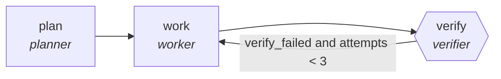

<!-- generated by scripts/gen_cards.py — edit graph.yaml / usecases/catalog.yaml, then `uv run python scripts/gen_cards.py` -->
# 🪪 AGR-010 · `docs-code-sync-audit`

> Workers execute every doc example against the current API.

| Card ID | Domain | Pattern | Nodes | Edges | Verifiers | Routers | Max steps | Risk surface |
|---|---|---|---|---|---|---|---|---|
| `AGR-010` | software-engineering | **parallel-swarm** | 3 | 3 | 1 | 0 | 30 | execute |

## The graph



Legend: `[/…/]` router · `{{…}}` verifier · `[…]` worker/agent node.

## What it does

Workers execute every doc example against the current API.

## Why it should deliver results

Independent workers cover disjoint slices of the input at the same time. Because they cannot see each other's drafts, agreement is evidence and disagreement surfaces blind spots; the aggregator merges with explicit rules. Wall-clock time is roughly the slowest worker, not the sum.

- **Exit contract** — all documented examples run exit zero
- **Machine-checked** — `all(e.exit_code == 0 for e in output.examples)`
- **Bounded** — hard stop after 30 steps; every loop edge is condition-guarded
- **Golden cases** — `uv run agr eval docs-code-sync-audit` replays recorded cases through the real edge/assert logic (mock runner proves mechanics; `--live` measures your model)
- **Trace gallery** — [every case's route, node outputs, and checked asserts](../../../docs/traces/docs-code-sync-audit.md)

## How to work with it

```bash
uv run agr show docs-code-sync-audit       # full definition
uv run agr profile docs-code-sync-audit    # deterministic structural facts
uv run agr mermaid docs-code-sync-audit    # regenerate the diagram below
uv run agr eval docs-code-sync-audit       # run golden cases (add --live for your endpoint)
uv run agr adapt docs-code-sync-audit --target langgraph > app.py   # compile to runnable LangGraph
uv run agr optimize docs-code-sync-audit   # propose bounded structural improvements (dry-run)
```

Over MCP: `uv run agr mcp` exposes the registry (search / show / profile) to any MCP client.
To evolve it: `uv run agr infuse docs-code-sync-audit <node> <ability>` — every mutation is gate-checked and appended to the graph's lineage log.

## Node roster

| Node | Speciality | Kind | Abilities |
|---|---|---|---|
| `plan` | planner | agent | decompose_goal |
| `work` | worker | agent | run_command, edit_files |
| `verify` | verifier | verifier | run_command |

## Edge logic

| From | To | Condition |
|---|---|---|
| `plan` | `work` | always |
| `work` | `verify` | always |
| `verify` | `work` | verify_failed and attempts < 3 |

## Optional use-cases

Adjacent entries from the use-case catalog this card adapts to with small edits:

- **api-design-review** (software-engineering, debate) — Two reviewers argue REST versus RPC tradeoffs, judge synthesizes. *Verify:* spec passes lint; breaking changes enumerated.
- **brand-consistency-audit** (content-marketing, parallel-swarm) — Workers audit assets against voice and visual guidelines. *Verify:* violations reported per asset with rule ids.
- **regulatory-filing-check** (finance, parallel-swarm) — Workers check filing sections against requirement checklists. *Verify:* every checklist item pass or fail with location.
- **supply-chain-audit** (security, parallel-swarm) — Workers audit dependencies for provenance and tampering. *Verify:* attestations verified; unsigned artifacts listed.
- **planogram-compliance-review** (logistics-retail, parallel-swarm) — Workers check shelf photos against planograms. *Verify:* violations localized per fixture with confidence.

---
*Regenerate: `uv run python scripts/gen_cards.py` · Index: [CARDS.md](../../../CARDS.md)*
