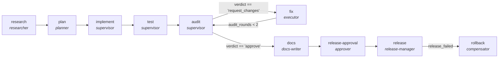

<!-- generated by scripts/gen_cards.py — edit graph.yaml / usecases/catalog.yaml, then `uv run python scripts/gen_cards.py` -->
# 🪪 AGR-115 · `feature-delivery-lifecycle`

> End-to-end feature delivery: research a problem, plan it, implement it, test it, audit the change, fix what the audit found, document it, and release behind a human gate with a rollback path. The implement, test and audit phases are not re-authored here — they reference the existing single-purpose graphs as subgraphs.

| Card ID | Domain | Pattern | Nodes | Edges | Verifiers | Routers | Max steps | Risk surface |
|---|---|---|---|---|---|---|---|---|
| `AGR-115` | software-engineering | **lifecycle** | 10 | 10 | 0 | 0 | 60 | execute |

> 🎯 **Requires a goal** — the feature to deliver and the repository to deliver it in. Without one the graph refuses and runs no node.

## The graph



Legend: `[/…/]` router · `{{…}}` verifier · `[…]` worker/agent node.

## What it does

Research, plan, implement, test, audit, fix, document and release a feature end to end.

## Why it should deliver results

A multi-phase workflow where each phase is itself a motif and hand-offs are explicit. Phases that duplicate an existing single-purpose graph reference it with `kind: subgraph` instead of restating it, so the flat library becomes the component library and a fix to a child propagates to every composite using it.

- **Exit contract** — A release is cut only after the audit verdict is approve, docs are updated, and a human signs off; a failed release is compensated by a rollback.
- **Machine-checked** — `output.verdict == 'approve'`
- **Machine-checked** — `output.docs_updated == true`
- **Machine-checked** — `output.signed_off == true`
- **Machine-checked** — `output.released == true or output.rolled_back == true`
- **Command-checked** — `pytest -q`
- **Bounded** — hard stop after 60 steps; every loop edge is condition-guarded
- **Golden cases** — `uv run agr eval feature-delivery-lifecycle` replays recorded cases through the real edge/assert logic (mock runner proves mechanics; `--live` measures your model)
- **Trace gallery** — [every case's route, node outputs, and checked asserts](../../../docs/traces/feature-delivery-lifecycle.md)

## How to work with it

```bash
uv run agr show feature-delivery-lifecycle       # full definition
uv run agr profile feature-delivery-lifecycle    # deterministic structural facts
uv run agr mermaid feature-delivery-lifecycle    # regenerate the diagram below
uv run agr eval feature-delivery-lifecycle       # run golden cases (add --live for your endpoint)
uv run agr adapt feature-delivery-lifecycle --target langgraph > app.py   # compile to runnable LangGraph
uv run agr optimize feature-delivery-lifecycle   # propose bounded structural improvements (dry-run)
```

Over MCP: `uv run agr mcp` exposes the registry (search / show / profile) to any MCP client.
To evolve it: `uv run agr infuse feature-delivery-lifecycle <node> <ability>` — every mutation is gate-checked and appended to the graph's lineage log.

## Node roster

| Node | Speciality | Kind | Abilities |
|---|---|---|---|
| `research` | researcher | agent | read_papers, web_search |
| `plan` | planner | agent | decompose_goal |
| `implement` | supervisor | subgraph | — |
| `test` | supervisor | subgraph | — |
| `audit` | supervisor | subgraph | — |
| `fix` | executor | agent | execute_step, edit_files |
| `docs` | docs-writer | agent | write_docs, read_diff |
| `release-approval` | approver | human | approve |
| `release` | release-manager | agent | cut_release |
| `rollback` | compensator | agent | rollback |

## Edge logic

| From | To | Condition |
|---|---|---|
| `research` | `plan` | always |
| `plan` | `implement` | always |
| `implement` | `test` | always |
| `test` | `audit` | always |
| `audit` | `fix` | verdict == 'request_changes' |
| `audit` | `docs` | verdict == 'approve' |
| `fix` | `audit` | audit_rounds < 2 |
| `docs` | `release-approval` | always |
| `release-approval` | `release` | always |
| `release` | `rollback` | release_failed |

## Optional use-cases

Adjacent entries from the use-case catalog this card adapts to with small edits:

- **api-design-review** (software-engineering, debate) — Two reviewers argue REST versus RPC tradeoffs, judge synthesizes. *Verify:* spec passes lint; breaking changes enumerated.

---
*Regenerate: `uv run python scripts/gen_cards.py` · Index: [CARDS.md](../../../CARDS.md)*
