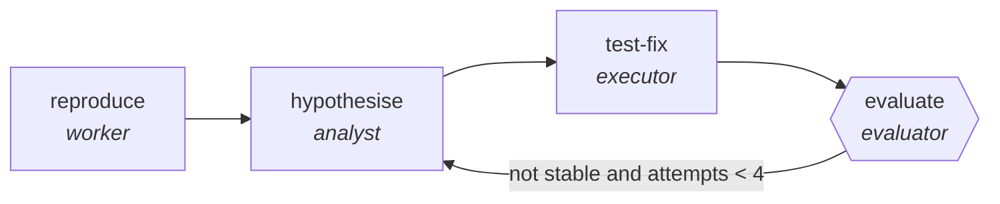

<!-- generated by scripts/gen_cards.py — edit graph.yaml / usecases/catalog.yaml, then `uv run python scripts/gen_cards.py` -->
# 🪪 AGR-128 · `flaky-test-reflexion`

> Re-run a suspected flake, write down what was learned each time, and use it on the next attempt.

| Card ID | Domain | Pattern | Nodes | Edges | Verifiers | Routers | Max steps | Risk surface |
|---|---|---|---|---|---|---|---|---|
| `AGR-128` | software-engineering | **reflexion** | 4 | 4 | 1 | 0 | 40 | execute |

## The graph



Legend: `[/…/]` router · `{{…}}` verifier · `[…]` worker/agent node.

## What it does

Re-run a suspected flake, recording a lesson per attempt.

## Why it should deliver results

Each failed attempt writes down what was learned, and the next attempt reads it. A plain retry loop re-runs the same reasoning against the same inputs and fails the same way; this one narrows. Lessons are scoped memory, so what the graph learned is inspectable rather than buried in a context window.

- **Exit contract** — stability is proven over repeated runs, and every failed attempt is recorded as a lesson
- **Machine-checked** — `output.consecutive_green >= 3`
- **Machine-checked** — `len(output.lessons) >= 1`
- **Bounded** — hard stop after 40 steps; every loop edge is condition-guarded
- **Golden cases** — `uv run agr eval flaky-test-reflexion` replays recorded cases through the real edge/assert logic (mock runner proves mechanics; `--live` measures your model)
- **Trace gallery** — [every case's route, node outputs, and checked asserts](../../../docs/traces/flaky-test-reflexion.md)

## How to work with it

```bash
uv run agr show flaky-test-reflexion       # full definition
uv run agr profile flaky-test-reflexion    # deterministic structural facts
uv run agr mermaid flaky-test-reflexion    # regenerate the diagram below
uv run agr eval flaky-test-reflexion       # run golden cases (add --live for your endpoint)
uv run agr adapt flaky-test-reflexion --target langgraph > app.py   # compile to runnable LangGraph
uv run agr optimize flaky-test-reflexion   # propose bounded structural improvements (dry-run)
```

Over MCP: `uv run agr mcp` exposes the registry (search / show / profile) to any MCP client.
To evolve it: `uv run agr infuse flaky-test-reflexion <node> <ability>` — every mutation is gate-checked and appended to the graph's lineage log.

## Node roster

| Node | Speciality | Kind | Abilities |
|---|---|---|---|
| `reproduce` | worker | agent | run_command |
| `hypothesise` | analyst | agent | analyze |
| `test-fix` | executor | agent | execute_step, edit_files |
| `evaluate` | evaluator | verifier | evaluate, run_command |

## Edge logic

| From | To | Condition |
|---|---|---|
| `reproduce` | `hypothesise` | always |
| `hypothesise` | `test-fix` | always |
| `test-fix` | `evaluate` | always |
| `evaluate` | `hypothesise` | not stable and attempts < 4 |

## Optional use-cases

Adjacent entries from the use-case catalog this card adapts to with small edits:

- **api-design-review** (software-engineering, debate) — Two reviewers argue REST versus RPC tradeoffs, judge synthesizes. *Verify:* spec passes lint; breaking changes enumerated.

---
*Regenerate: `uv run python scripts/gen_cards.py` · Index: [CARDS.md](../../../CARDS.md)*
