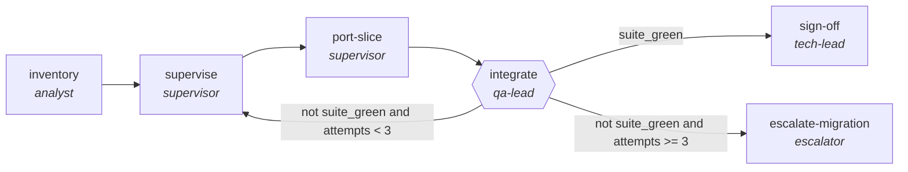

<!-- generated by scripts/gen_cards.py — edit graph.yaml / usecases/catalog.yaml, then `uv run python scripts/gen_cards.py` -->
# 🪪 AGR-005 · `framework-migration`

> Port a codebase between frameworks in verifiable slices, each slice delegated to a refactor subgraph.

| Card ID | Domain | Pattern | Nodes | Edges | Verifiers | Routers | Max steps | Risk surface |
|---|---|---|---|---|---|---|---|---|
| `AGR-005` | software-engineering | **planner-executor-verifier** | 6 | 6 | 1 | 0 | 60 | execute |

> 🎯 **Requires a goal** — the codebase to port, its source framework and its target framework. Without one the graph refuses and runs no node.

## The graph



Legend: `[/…/]` router · `{{…}}` verifier · `[…]` worker/agent node.

## What it does

Port a codebase between frameworks in verifiable slices.

## Why it should deliver results

The plan makes intent inspectable before anything touches the world, the executor works inside that plan, and the verifier proves the postcondition actually holds — success is demonstrated, not asserted.

- **Exit contract** — build and full test suite green on the target stack with no slice left behind
- **Command-checked** — `pytest -q`
- **Machine-checked** — `output.slices_remaining == 0`
- **Bounded** — hard stop after 60 steps; every loop edge is condition-guarded
- **Golden cases** — `uv run agr eval framework-migration` replays recorded cases through the real edge/assert logic (mock runner proves mechanics; `--live` measures your model)
- **Trace gallery** — [every case's route, node outputs, and checked asserts](../../../docs/traces/framework-migration.md)

## How to work with it

```bash
uv run agr show framework-migration       # full definition
uv run agr profile framework-migration    # deterministic structural facts
uv run agr mermaid framework-migration    # regenerate the diagram below
uv run agr eval framework-migration       # run golden cases (add --live for your endpoint)
uv run agr adapt framework-migration --target langgraph > app.py   # compile to runnable LangGraph
uv run agr optimize framework-migration   # propose bounded structural improvements (dry-run)
```

Over MCP: `uv run agr mcp` exposes the registry (search / show / profile) to any MCP client.
To evolve it: `uv run agr infuse framework-migration <node> <ability>` — every mutation is gate-checked and appended to the graph's lineage log.

## Node roster

| Node | Speciality | Kind | Abilities |
|---|---|---|---|
| `inventory` | analyst | agent | analyze |
| `supervise` | supervisor | agent | delegate, decompose_goal |
| `port-slice` | supervisor | subgraph | — |
| `integrate` | qa-lead | verifier | run_suite |
| `sign-off` | tech-lead | agent | read_diff |
| `escalate-migration` | escalator | agent | escalate |

## Edge logic

| From | To | Condition |
|---|---|---|
| `inventory` | `supervise` | always |
| `supervise` | `port-slice` | always |
| `port-slice` | `integrate` | always |
| `integrate` | `supervise` | not suite_green and attempts < 3 |
| `integrate` | `sign-off` | suite_green |
| `integrate` | `escalate-migration` | not suite_green and attempts >= 3 |

## Optional use-cases

Adjacent entries from the use-case catalog this card adapts to with small edits:

- **api-design-review** (software-engineering, debate) — Two reviewers argue REST versus RPC tradeoffs, judge synthesizes. *Verify:* spec passes lint; breaking changes enumerated.
- **schema-migration-planner** (data-analytics, planner-executor-verifier) — Plan backward-compatible schema changes with shadow reads. *Verify:* shadow-read diff empty before cutover.
- **social-campaign-planner** (content-marketing, planner-executor-verifier) — Plan a campaign calendar, draft posts, verify constraints. *Verify:* calendar has no channel conflicts; lengths within limits.
- **bioinformatics-pipeline-builder** (healthcare-science, planner-executor-verifier) — Assemble genomics workflow with validated steps. *Verify:* pipeline reproduces reference results on test data.
- **curriculum-designer** (education, planner-executor-verifier) — Design course from outcomes to assessments with alignment. *Verify:* every outcome mapped to lesson and assessment.

---
*Regenerate: `uv run python scripts/gen_cards.py` · Index: [CARDS.md](../../../CARDS.md)*
