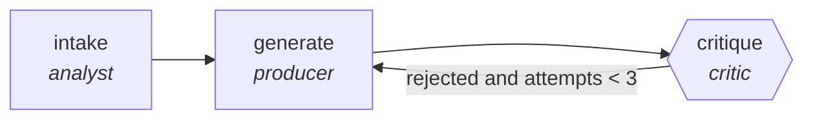

<!-- generated by scripts/gen_cards.py — edit graph.yaml / usecases/catalog.yaml, then `uv run python scripts/gen_cards.py` -->
# 🪪 AGR-003 · `test-suite-generation`

> Generate tests, critic rejects trivial or tautological assertions.

| Card ID | Domain | Pattern | Nodes | Edges | Verifiers | Routers | Max steps | Risk surface |
|---|---|---|---|---|---|---|---|---|
| `AGR-003` | software-engineering | **generator-critic** | 3 | 3 | 1 | 0 | 10 | execute |

> 🎯 **Requires a goal** — the module to test and the coverage or mutation bar it must clear. Without one the graph refuses and runs no node.

## The graph



Legend: `[/…/]` router · `{{…}}` verifier · `[…]` worker/agent node.

## What it does

Generate tests, critic rejects trivial or tautological assertions.

## Why it should deliver results

The generator optimizes for recall, the critic for precision. Nothing is accepted until the critic signs off, which filters out trivial, tautological, or hallucinated output before it ever reaches you.

- **Exit contract** — coverage delta positive; mutation score above baseline
- **Machine-checked** — `output.coverage_delta > 0 and output.mutation_score > output.mutation_baseline`
- **Command-checked** — `pytest -q`
- **Bounded** — hard stop after 10 steps; every loop edge is condition-guarded
- **Golden cases** — `uv run agr eval test-suite-generation` replays recorded cases through the real edge/assert logic (mock runner proves mechanics; `--live` measures your model)
- **Trace gallery** — [every case's route, node outputs, and checked asserts](../../../docs/traces/test-suite-generation.md)

## How to work with it

```bash
uv run agr show test-suite-generation       # full definition
uv run agr profile test-suite-generation    # deterministic structural facts
uv run agr mermaid test-suite-generation    # regenerate the diagram below
uv run agr eval test-suite-generation       # run golden cases (add --live for your endpoint)
uv run agr adapt test-suite-generation --target langgraph > app.py   # compile to runnable LangGraph
uv run agr optimize test-suite-generation   # propose bounded structural improvements (dry-run)
```

Over MCP: `uv run agr mcp` exposes the registry (search / show / profile) to any MCP client.
To evolve it: `uv run agr infuse test-suite-generation <node> <ability>` — every mutation is gate-checked and appended to the graph's lineage log.

## Node roster

| Node | Speciality | Kind | Abilities |
|---|---|---|---|
| `intake` | analyst | agent | analyze |
| `generate` | producer | agent | generate |
| `critique` | critic | verifier | critique, run_command |

## Edge logic

| From | To | Condition |
|---|---|---|
| `intake` | `generate` | always |
| `generate` | `critique` | always |
| `critique` | `generate` | rejected and attempts < 3 |

## Optional use-cases

Adjacent entries from the use-case catalog this card adapts to with small edits:

- **api-design-review** (software-engineering, debate) — Two reviewers argue REST versus RPC tradeoffs, judge synthesizes. *Verify:* spec passes lint; breaking changes enumerated.
- **capacity-forecaster** (devops-sre, generator-critic) — Forecast load, critic stress-tests assumptions against history. *Verify:* backtest error within stated confidence band.
- **survey-design-critic** (research-knowledge, generator-critic) — Draft survey, critic hunts leading and double-barreled items. *Verify:* zero flagged items remain; branching logic validated.
- **ad-variant-tournament** (content-marketing, generator-critic) — Generate ad variants, critic ranks against brand and claim rules. *Verify:* surviving variants pass legal claim checklist.
- **video-script-writer** (content-marketing, generator-critic) — Script drafts critiqued for hook, pacing, and claim accuracy. *Verify:* runtime estimate within brief; claims sourced.

---
*Regenerate: `uv run python scripts/gen_cards.py` · Index: [CARDS.md](../../../CARDS.md)*
